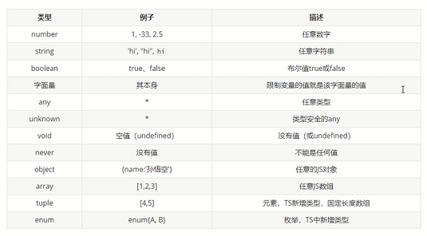

# typescript-learn
TS学习
# 一、TS是什么
- 1.是以JS为基础构建的语言，可在任何支持JS的平台中执行
- 2.TS是JS的超集(扩展，新特性)，TS扩展了JS并添加了类型
- 3. TS不能直接被JS解析器执行，需要编译----TS=====编译===》JS
# 二、TS基础
- 安装npm i typescript -g
## 2.1 基本变量
- 申明变量给变量同时指定类型
- 
```ts
//1.数字
let a:number;

//2.布尔类型
let b:boolean;

//3.字符串 
let tom:string;

//4.数组Array<类型>
let list:number[];//数组数字类型
let list2:Array<number>;//Array<>

//5.元组 Tuple
let d:[number,string];
let d2:[string,number];
d = [222,'tom'];
d2 = ['tom',222];
console.log(d2[0].substr(1)); // OK
// console.log(d[5].toString()); // OK, 'string' 和 'number' 都有 toString

//6.enum 枚举
enum Color {Red, Green, Blue}
let c: Color = Color.Green; 
enum Color2 {Red = 1, Green=2, Blue}
let colorName: string = Color2[2];
console.log(colorName);  // 显示'Green'因为上面代码里它的值是2

//7.Any类型--想要为那些在编程阶段还不清楚类型的变量指定一个类型使用any
let x: any = 4;
x = "tom";
x = false; // 最终布尔类型

//8.Void------void类型像是与any类型相反，它表示没有任何类型。 当一个函数没有返回值时，你通常会见到其返回值类型是 void：
//声明一个void类型的变量只能赋予undefined和null：
let xx: void = undefined;
function shang(): void {
  console.log("tom");
}
//9.Null 和 Undefined
let u: undefined = undefined;
let n: null = null;

//10.Never--------never类型表示的是那些永不存在的值的类型;never类型是任何类型的子类型，也可以赋值给任何类型
//没有类型是never的子类型或可以赋值给never类型（除了never本身之外）。 即使 any也不可以赋值给never。
// 返回never的函数必须存在无法达到的终点
function error(message: string): never {
  throw new Error(message);
}

// 推断的返回值类型为never
function fail() {
  return error("Something failed");
}

// 返回never的函数必须存在无法达到的终点
function infiniteLoop(): never {
  while (true) {
  }
}

//11.Object 表示非原始类型

declare function create(o: object | null): void;

create({ prop: 0 }); // OK
create(null); // OK

// create(42); // Error
// create("string"); // Error
// create(false); // Error
// create(undefined); // Error
```
### 2.1.1类型断言
- 用来告诉解析器变量的实际类型
```ts
/**
 * 语法：
 *  变量 as 类型
 *  <类型>变量
 * 
 * */
s = a as string
s = <string>a
``` 
### 2.1.2函数参数返回值
- 用来告诉解析器变量的实际类型
```ts
function a(x:string,y:boolean):number{
  retun 222
}
a('tom',true)
function b(){ //没写返回类型，返回viod

}
function b():void{ //无返回值
  // return null
}

function b():never{ //什么都不返回，没有值
  // return null
}
``` 
## 2.2TS中类型
```ts

```
